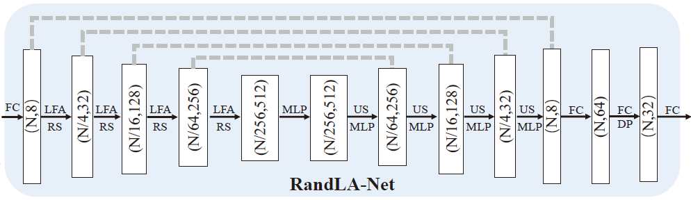

<ul>
<li><a href="#First_Point_Header">1. Point Cloud</a>
				</li>
				<li><a href="#Second_Point_Header">2. RandLaNet - Architecture</a></li>
				<li><a href="#Third_Point_Header">3. RandLaNet - LFA</a></li>
				<li><a href="#Fourth_Point_Header">4. RandLaNet - Decoder</a></li>
				<li><a href="#Fifth_Point_Header">5. Results</a></li>
</ul>

 

  <h1 id="First_Point_Header">1. Point Cloud</h1>
  

  $\textbf{A. Introduction}$
  

  

  A Point Cloud is a set of points in 3D space which can represent the boundary or the whole object (including inside points). In a point cloud, the points are unordered and are not restricted by any grid which means a point cloud can be expressed in an infinite way (using translation). Each point can have 3D coordinates and feature vectors ($P=\{(X_i,F_i)\}^{i=N}_{i=1}, X_i\in\mathbb{R}^3,F_i\in\mathbb{R}^d$).
  

  

  $\textbf{B. Properties of Point Cloud in}$ $\mathbb{R}^3$
  

  

 <ul>
    <li> $\textit{Unordered:}$ Unlike images or arrays, point cloud is unordered. It has no restriction to be confined within a boundary. This causes a problem for CNN type architecture to learn since CNN uses convolutional operations which requires ordered and regular array like representation of the input. Point cloud networks are generally invariant to the $N!$ number of permutations in input.</li>
   <li> $\textit{Irregularity:}$ Points are not sampled uniformly from an image which means different organs can have dense points while others sparse [1, 2]. This causes class imbalance problems in point cloud dataset.</li>
    <li> $\textit{Connectedness:}$ Since points are not connected like graph structure and neighbouring points contain meaningful spatial and geometry information of the organ, networks must learn to pass information from points to points.</li>
</ul>
  

  
  <h1 id="Second_Point_Header">2. RandLaNet - Architecture</h1>
  

  Large-scale point cloud segmentation is a challenging task because of huge computational requirements and effective embedding learning. RandLa-Net[3] is an efficient and lightweight neural architecture that segments every point in large-scale point clouds. It is an encoder-decoder-like architecture that uses random sampling to downsample the input point cloud in the encoder and upsample the point cloud in decoder blocks. It uses random sampling compared to other sampling methods because of faster computation. Although random sampling can discard key points necessary for efficient point cloud segmentation, RandLa-Net implements attention-based local feature aggregation to effectively share features of points that are removed into the neighbor points. Figure[1] is the architecture of RandLa-Net. The main properties of RandLa-Net are <ul>
  <li>It is lightweight and achieves state-of-the-art results compared to existing methods. The random sampling method reduces the computation.</li>
  <li> The proposed attention-based Local Feature Aggregation (LFA) can expand into larger receptive fields using Local Spatial Encoding (LSE) with attentive pooling of point and neighbor features.</li> 
  <li> The network consists of Shared MLP without any need of graph reconstruction or voxelization. </li>
  <li> The encoder-decoder architecture with downsampling aims to generate discriminative latent vectors using small samples which represent the objects of interest. </li>
  </ul>
  <figure>
					
 

					<figcaption class="figure-caption text-center">Figure 1:  RandLa-Net Architecture.  FC is the fully connected layer, LFA is the localfeature aggregation, RS is random sampling, MLP is shared multilayer perceptron,US is upsampling and DP is dropout.  (Image from [3])
					</figcaption>
				</figure>
  

  

  $\textbf{A. Random Sampling}$
  

  

   Compared to other sampling methods, Random sampling is extremely fast (time complexity $O(N)$). It is invariant to any changes to the points as well as the permutation of points. The random-sampling block is added in encoder part. To compensate for the loss of information, the author has added LFA module.
   <figure>
					
 

					<figcaption class="figure-caption text-center">Figure 2: Random Sampling in RandLa-Net.  The downsampling rate is a hyperparameter and has significant influence on model performance (Image from [3])
					</figcaption>
				</figure>
   
  

   

  $\textbf{B. Architecture}$
  

  

  RandLa-Net consists of 4 encoder and 4 decoder layers (Figure 1). Each encoder layer consists of LFA modules (which is shown in the bottom panel of Figure 3). LFA modules aggregate the local features and gradually expands the receptive field to perform global feature passing. Every LFA module is followed by a random sampling step. Let the input shape be $N\times d_n$, where $N$ is the number of points in the point clouds ($N\approx 10^6 - 10^7$) and $d_n \in \mathbb{R^d},d\geq3$). $d_n$ can contain the coordinates with other features like intensity, gradient or normal.
  

  

  $\textbf{Positional Encoding:}$Since point clouds are unstructured, positional encoding layer embeds the positional information in an 8 dimensional vector ($3\rightarrow 8$). This layer describes the location of a point by mapping the position/index of a point into a vector and assigning unique representation for every point. In this way, positional encoding layer makes the network more permutation-invariant.
  

  

  $\textbf{Encoding Layer:}$ The encoding layer progressively reduces the number of points and increases the point features. The point cloud is downsampled at each encoding layer after the dilated residual block by downsampling factor 4 ($N\rightarrow \frac{N}{4} \rightarrow \frac{N}{4^2} \rightarrow \frac{N}{4^3} \rightarrow \frac{N}{4^4}$). The per-point feature dimension is increased gradually ($8 \rightarrow 32 \rightarrow 128 \rightarrow 256 \rightarrow 512$).
  

  

  $\textbf{Decoding Layer:}$ In each decoder layer, points are upsampled. In each encoder layer, when a point is removed, it is stored as a reference. In subsequent decoding layer, (i.e the layer with which a skip connection is added from an encoder in Figure 1 for each query reference point, KNN is used to find the one nearest neighbor in the input set of points. Afterwards, feature of the nearest point is copied to the target point. Subsequently, the feature maps are concatenated with the feature maps produced by corresponding encoding layers through skip connections. Then a shared MLP is applied to the concatenated feature maps. Shared MLP means same MLP network for every point in the input point cloud.
  

  

  $\textbf{Final Output Layer:}$ The segmentation label is predicted through three fully connected layers $(N,64) \rightarrow (N,32) \rightarrow (N,C)$, where $C$ is the number of classes.
  

  <h1 id="Third_Point_Header">2. RandLaNet - LFA</h1>
  
The Local Feature Aggregation follows a three-step message passing system. Since point cloud don't have connectivity information, LFA ensures features are shared between points. In Figure 1, the LFA module in the first encoder transforms the feature vector ($8 \rightarrow 32$) and random sampling removes 75% of the points. Let's take a point in the first encoder $(p,f),p\in \mathbb{R}^3,f\in \mathbb{R}^8$.
  <figure>
					
 

					<figcaption class="figure-caption text-center">Figure 3: RandLaNet Feature Sharing
					</figcaption>
	</figure>
	 Let's take a overview of how this happens before diving deep into it. 
   <ul>
  <li>$\textbf{1. Sampling:}$ The first step in message passing system is from which points we want to pass a message to the red point $p$ in Figure 3. K-Nearest Neighbor is used to find $K$ neighbor points (blue points) which will share its features with red point $p$.</li>
  <li> $\textbf{2. Message Generation:}$ Once we choose the points, we need to generate the message to send from blue points to red point. For every point, $p_i$, we will generate a message $f_i$ by incorporating the distance and spatial information using an MLP. This MLP will give us the desired dimension of feature vector for $f_i,\forall i=1,2,\cdots,K$.</li>
  <li> $\textbf{3. Message Passing:}$ There are several ways to share features from neighbor points. We can use MAX, AVG or SUM function. But the best method is use linear sum of the features $f=\sum\limits_{i=1}^{6}\alpha_if_i$, with $\alpha_i$ as learnable by the model. This $\alpha_i$ is the attention score. It makes sure to give more weights during aggregation to points of similar nature or belonging to the same object.
  </li>
  </ul>
  
  

  
  
<h1>Bibliography</h1>
      <ol>
         <li>
            
Anh Nguyen, Bac Le, <cite>3D Point Cloud Segmentation - A Survey</cite>, 2013 6th IEEE Conference on Robotics, Automation and Mechatronics (RAM), 2013, pp. 225-230.

         </li>
         <li>
            
Charles R. Qi, Hao Su, Kaichun Mo, Leonidas J. Guibas., <cite>PointNet: Deep Learning on Point Sets for 3D Classification and Segmentation</cite>, 2017 IEEE Conference on Computer Vision and Pattern Recognition (CVPR), 2017, pp. 77-85.

         </li>
          <li>
            
Qingyong Hu, Bo Yang, Linhai Xie, Stefano Rosa, Yulan Guo, Zhihua Wang, A. Trigoni, A. Markham., <cite>RandLA-Net: Efficient Semantic Segmentation of Large-Scale Point Clouds</cite>,  2020 IEEE/CVF Conference on Computer Vision and Pattern Recognition (CVPR).

         </li>
      </ol>

